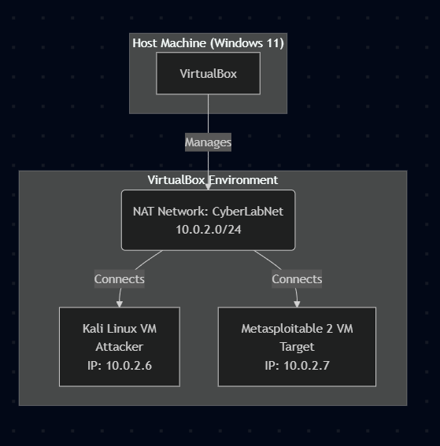
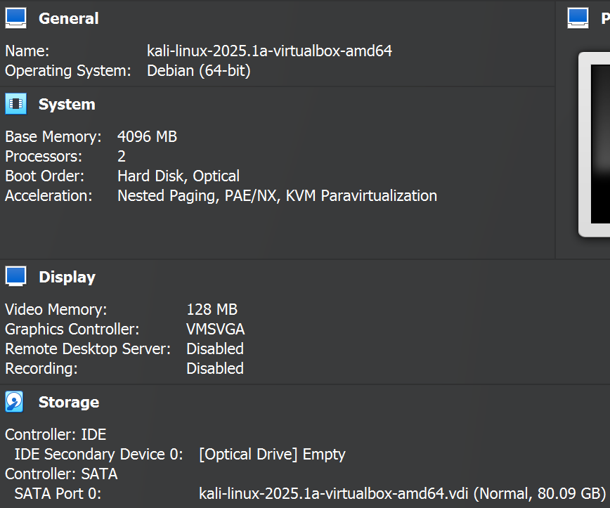
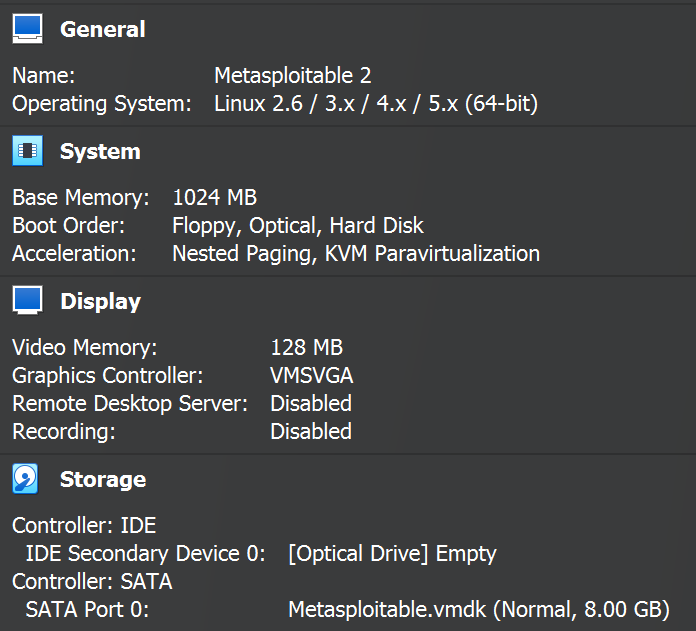
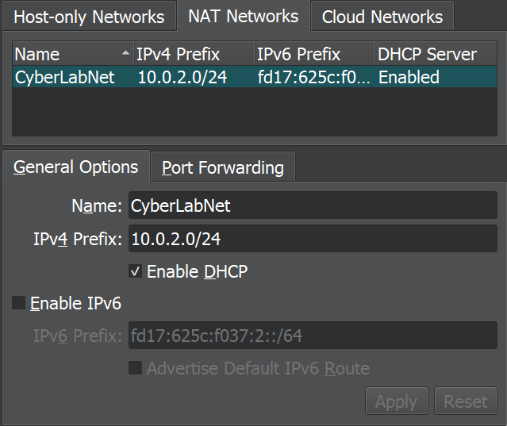

# Project: Linux Security Lab Environment Setup

## Project Goal

The primary goal of this project was to build a foundational, isolated virtual lab environment using VirtualBox. This lab serves as a safe space for learning cybersecurity fundamentals, practicing network scanning, vulnerability analysis, ethical hacking techniques, and testing security tools without impacting my main network or computer.

## Tools & Technologies Used

* **Virtualization:** VirtualBox Version 7.0.18 
* **Host Operating System:** Windows 11
* **Virtual Machines:**
    * Kali Linux [Official VirtualBox Image 2025.1](https://www.kali.org/docs/virtualization/import-premade-virtualbox/)
    * Metasploitable 2 [Official download](https://docs.rapid7.com/metasploit/metasploitable-2/)
    * Ubuntu Server 24.04.2 LTS [Official download](https://ubuntu.com/download/server)
## Lab Architecture

### Network Diagram

## Virtual Machines

### Kali Linux (Attacker)
* **Purpose:** Attacker machine for running security scans and tools.

### Metasploitable 2 (Target)

* **Purpose:** Intentionally vulnerable target machine for practice.

* **Notes:** Created new VM in VirtualBox and attached existing .vmdk. Boots to command line as expected.

## CyberLabNet

## Setup Process Summary

1.  Configured `CyberLabNet` NAT Network in VirtualBox Global Tools.
2.  Imported the official Kali Linux VirtualBox image.
3.  Changed default Kali credentials and fully updated the system.
4.  Created a new VM shell for Metasploitable 2 (Linux/Ubuntu 32-bit).
5.  Attached the downloaded Metasploitable 2 `.vmdk` as the existing hard disk.
6.  Configured network adapters for both VMs to use `CyberLabNet`.
7.  Adjusted RAM and vCPU allocation for performance.

## Verification

* Successfully booted both Kali Linux (graphical interface) and Metasploitable 2 (command-line interface).
* Confirmed both VMs received IP addresses within the `10.0.2.0/24` range from `CyberLabNet`.
* Verified network connectivity between Kali and Metasploitable 2 using `ping 10.0.2.7` from the Kali terminal.

